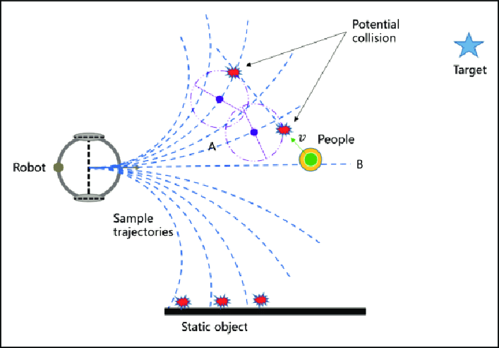

# DWA manual


# 1. DWA란?

DWA는 Dynamic window approach의 약자로 경로 판단 알고리즘이다. 로봇의 좌표, 센서로부터 얻는 장애물과의 거리를 토대로 최적의 선속도와 각속도를 도출해내어 장애물을 회피하며 목적지로 도달하는 알고리즘이다.
 


# 2. DWA 구현 대략적인 내용

**<사용된 정보>**
 센서로부터 얻는 장애물과의 거리 (360개), tf를 사용하여 실시간으로 변하는 로봇의 좌표, 고정된 목표의 좌표

**<구현>**
-두개의 배열을 만들고 한개의 배열엔 속도값, 나머지 배열엔 각속도값을 임의로 넣는다.

-두 배열을 numpy함수를 이용해 행렬로 만든다.

-행렬의 각 인덱스마다 장애물과 얼마나 멀어지는지, 목표와 얼마나 가까워지는지를 고려하여 점수를 매긴다.

-점수를 매기는 작업은 행렬연산을 통해 모든 인덱스 한꺼번에 계산한다.

-점수를 모두 매기고 나면 (속도X각속도) 행렬이 나오는데 거기서 가장 큰 인덱스를 선택해서 속도와 각속도를 선택한다.

-선택된 속도, 각속도를 publish해서 로봇을 움직인다.


# 3. DWA 실행 환경 설정

## 3.1 DWA 패키지 다운

```bash
$ cd ~/catkin_ws/src
$ git clone -b DWA_robot --single-branch https://github.com/HyeWon33/AutonomousShippingRobot.git
```


# 4. DWA 실행

## 4.1 ROS마스터와 ROS파라미터 서버 실행

```bash
$ roscore
```

노드를 실행하기 전에 ROS 마스터와 ROS 파라미터 서버를 먼저 시작해야 한다. 이때 ROS 마스터와 ROS 파라미터를 실행시키는 명령어가 roscore이다.

## 4.2 robot을 원격 연결

```bash
$ ssh {robot_id}@{robot_ip}
$ roslaunch turtlebot3_bringup turtlebot3_robot.launch
```

## 4.3 gmapping 실행

```bash
$ roslaunch navigation gmapping.launch
```

## 4.4 robot 현재 좌표 pub노드 실행

```bash
$ rosrun navigation send_current_xyz.py
```

목표지점을 찾아가기 위해선 로봇의 현재위치를 받을 필요가 있다.

## 4.5 DWA노드 실행

```bash
$ rosrun DWA_robot DWAtest.py
```


DWA가 실행되기 위해서 필요한 노드들이다. 하지만 manipulator, camera와 협동 하기 위해선 manipulator, camera관련 코드도 실행을 해야한다.


# DWA 코드 설명
코드에 주석으로 설명 포함
